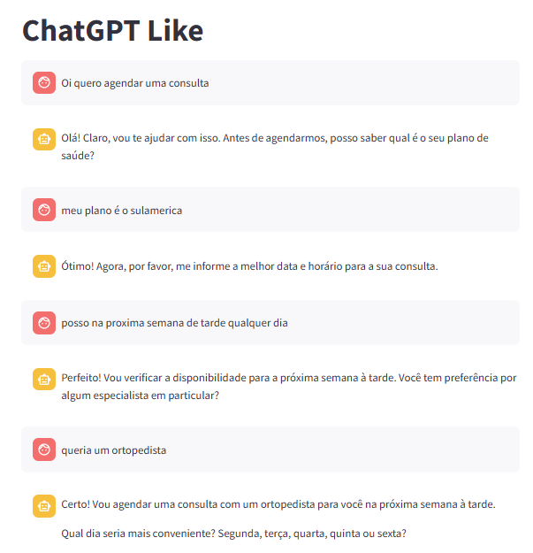

# 🤖 Implementação simples do OpenAI com Streamlit

Este projeto é uma demonstração de um **secretário virtual para agendamento de consultas**, utilizando a API da OpenAI com interface feita no Streamlit.

## 💡 Funcionalidades

- Interface de chat interativa com Streamlit
- Integração com a OpenAI (modelo GPT-4o-mini)
- Simulação de atendente para clínica médica
- Validação de plano de saúde (ex: Notredame não aceito)
- Armazenamento de histórico de conversa via `session_state`




## 🚀 Como executar

1. Clone o repositório:

   ```bash
   git clone https://github.com/Thiago-Brito/streamlit-chatbot.git
   cd streamlit-chatbot
   
2. Crie e ative um ambiente virtual:
    ```bash
    python -m venv ambiente
    ambiente\Scripts\activate

3. Instale as dependências:
    ```bash
    pip install -r requirements.txt

4. Configure sua chave da OpenAI: Crie o arquivo .streamlit/secrets.toml com:
    ```bash
    OPENAI_API_KEY = "sua-chave-aqui"

5. Execute o app:
    ```bash
    streamlit run main.py

